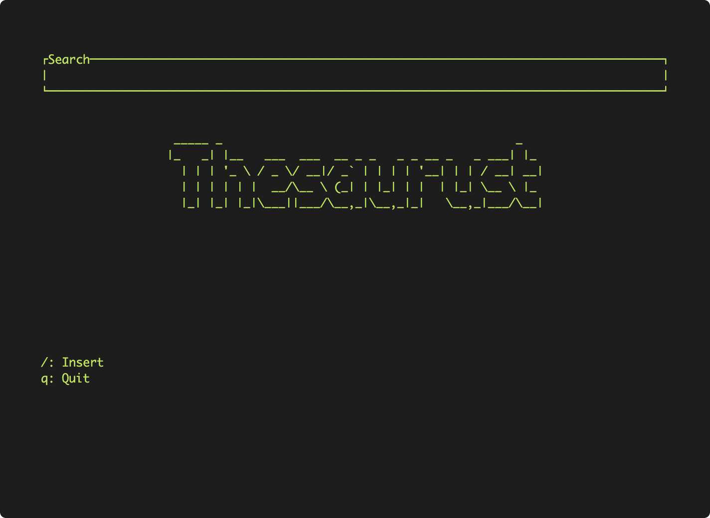

# thesaurust
A simple dictionary application built within the terminal, written in Rust. 

## How it works
The data is fetched from the API provided by https://dictionaryapi.dev/. Since words can contain more than one meanings, the user can toggle between different meanings based on the parts of speech the word has.
## Installation
You need to install [Rust](https://www.rust-lang.org/tools/install) before you can proceed.
<br>
Clone this repository:
```zsh
git clone https://github.com/QuietPigeon2001/thesaurust
```
Navigate to the repository and run the following commands:
```zsh
cargo install --path .
thesaurust
```
## Usage
* <kbd>/</kbd>: Insert the word you would like to look up.
* <kbd>Enter</kbd>: Search.
* <kbd>j</kbd>, <kbd>k</kbd>: Select the part of speech and press <kbd>Enter</kbd>.
* <kbd>l</kbd>, <kbd>h</kbd>: Toggle between multiple definitions.
* <kbd>q</kbd>: Exit the app.
## Roadmap
- [x] Show an example with the definition (if available)
- [x] Toggle between parts of speech 
- [x] Toggle between definitions with the same part of speech
- [ ] Use a spellchecking API to suggest correct spelling for words
- [ ] Show synonyms and antonyms
